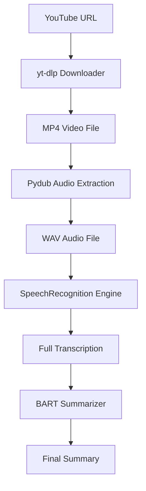

# GenTxt through YTlinks 🎥 ➡️ 📝

A powerful Python-based tool that automates the process of extracting knowledge from YouTube videos. It downloads the video, transcribes the audio into text, and provides an AI-generated summary using state-of-the-art Deep Learning models.

---

## 🚀 Features

- **Automated Download**: Seamlessly downloads YouTube videos in MP4 format using `yt-dlp`.
- **Audio Processing**: Extracts and converts audio to optimal WAV format (16kHz, mono) for high-accuracy recognition.
- **Smart Transcription**: Utilizes Google's Web Speech API for robust transcription of long-form content.
- **AI-Powered Summary**: Generates concise, meaningful summaries using the `facebook/bart-large-cnn` model via Hugging Face Transformers.
- **FFmpeg Integration**: High-performance media handling powered by FFmpeg.

---

## 🛠️ Workflow



---

## 📋 Prerequisites

Before running the project, ensure you have the following installed:

1.  **Python 3.12+**
2.  **FFmpeg**: This is a mandatory dependency for media processing.
    - Download it from [ffmpeg.org](https://ffmpeg.org/download.html).
    - Note the installation path (e.g., `C:/ffmpeg/bin/ffmpeg.exe`).

---

## ⚙️ Installation

1.  **Clone the Repository** (or navigate to the folder):
    ```bash
    cd "GenTxt throught YTlinks - Copy"
    ```

2.  **Set Up a Virtual Environment** (Recommended):
    ```bash
    python -m venv venv
    .\venv\Scripts\activate
    ```

3.  **Install Dependencies**:
    ```bash
    pip install -r requirements.txt
    ```

---

## 🔧 Configuration

The project requires specific paths for FFmpeg. If your FFmpeg is installed in a different location than `C:/ffmpeg/bin/`, you must update the following lines in `video_to_text.py`:

```python
# Lines 9-10 in video_to_text.py
FFMPEG_PATH = "C:/ffmpeg/bin/ffmpeg.exe"
FFPROBE_PATH = "C:/ffmpeg/bin/ffprobe.exe"
```

---

## 📖 Usage

Run the main script to start the process:

```bash
python video_to_text.py
```

1.  Enter a valid YouTube URL when prompted.
2.  The script will download the video and process it.
3.  The full transcription and AI summary will be displayed in the console.

---

## 📂 Project Structure

- `video_to_text.py`: The main application script.
- `check_ffmpeg.py`: Utility script to verify your FFmpeg installation.
- `requirements.txt`: List of Python dependencies.
- `audio.wav`: Temporary file for extracted audio.
- `downloaded_video.mp4`: Temporary file for the downloaded video.

---

## 🌟 Acknowledgments

- **yt-dlp**: For the powerful video downloading capabilities.
- **Hugging Face**: For providing the BART model for summarization.
- **Google Speech Recognition**: For the transcription engine.
- **Pydub**: For simplifying audio manipulation.
